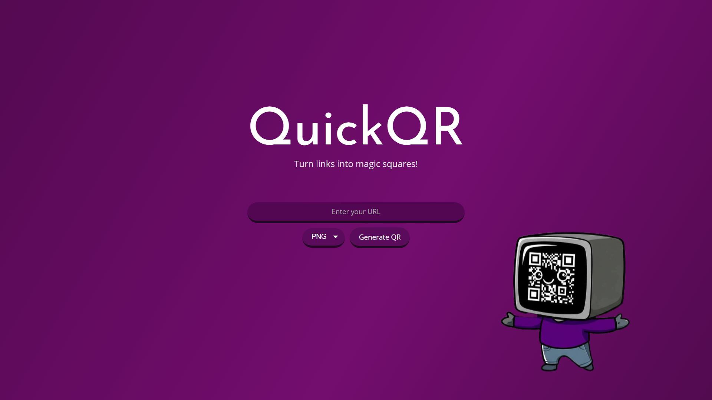

# QuickQR
### Turn links into magic squares.

A fast, simple and straightforward QR Code generator!

This lightweight and easy-to-use QR Code generator lets you instantly create QR codes for URLs, text, or any custom input. Built with simple HTML, CSS, and JavaScript, the app runs entirely in your browser—no downloads or logins required. No unnecessary Ads and annoying pop-ups. 

Just enter your content, generate the code, and scan or save it in seconds. Perfect for quick sharing, personal use, or projects that need a no-fuss tool.

### Tech Stack -
1. HTML 5
1. CSS 3
1. JavaScript

API used - https://goqr.me/api/doc/

TODO:

1. ~~Download instructions as per devices.~~
1. ~~Responsive design~~
1. ~~Smooth Animated background gradient~~
1. Add a file format selector somehow
1. Add a dimentions selector somehow
1.